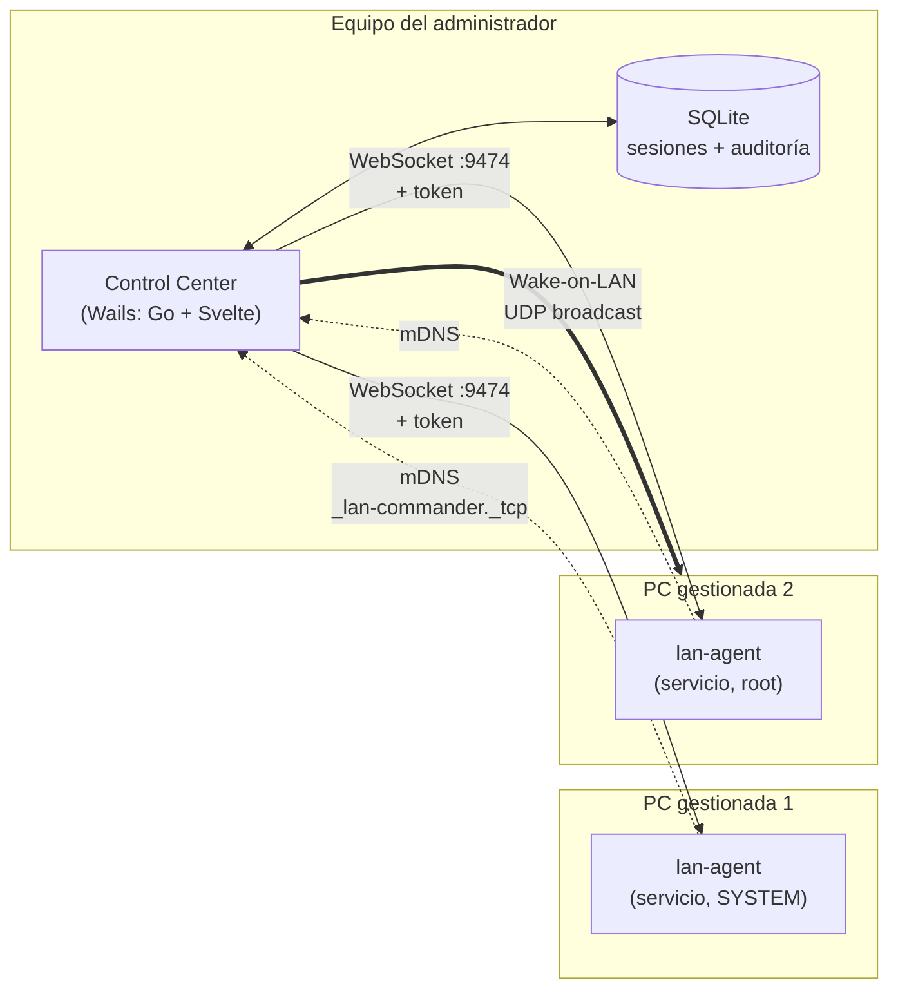
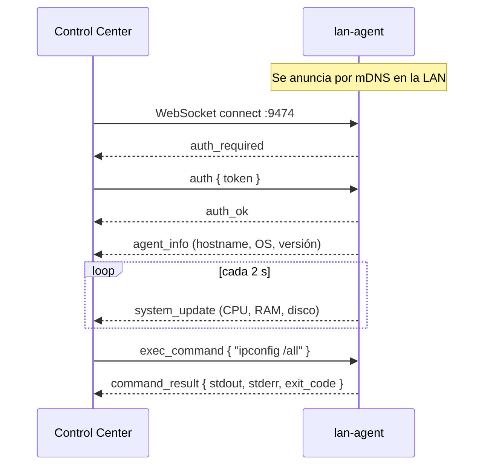

# LAN Commander

Herramienta de administración remota para equipos en una misma red local. Un panel
de escritorio controla agentes instalados en cada PC: ejecuta comandos, explora
archivos, captura pantalla, monitorea recursos y despierta equipos por Wake-on-LAN.

Pensada para redes donde no quieres exponer SSH ni depender de un servicio en la
nube: los agentes se anuncian por mDNS y todo el tráfico se queda en la LAN.

> **Estado del proyecto.** El panel de administración y el agente son funcionales.
> La interfaz para el usuario final de cada PC está diseñada y planificada, pero
> **todavía no implementada** — ver [Estado y hoja de ruta](#estado-y-hoja-de-ruta).
> Este README distingue explícitamente lo que ya funciona de lo que está en diseño.

---

## Índice

- [Arquitectura](#arquitectura)
- [Componentes](#componentes)
- [Casos de uso](#casos-de-uso)
- [Requisitos](#requisitos)
- [Instalación](#instalación)
- [Uso del Control Center](#uso-del-control-center)
- [Modelo de seguridad](#modelo-de-seguridad)
- [Compilar desde el código](#compilar-desde-el-código)
- [Estado y hoja de ruta](#estado-y-hoja-de-ruta)
- [Documentación adicional](#documentación-adicional)

---

## Arquitectura

Dos piezas: un **Control Center** en el equipo del administrador, y un **agente**
instalado como servicio en cada equipo gestionado.



El administrador **inicia** todas las conexiones. El agente es un servidor: escucha
y responde, nunca llama hacia afuera. Lo único que emite por su cuenta es el anuncio
mDNS que permite descubrirlo, y actualizaciones de estado a quien ya esté conectado.

### Flujo de una conexión



Si el agente no tiene token configurado acepta conexiones anónimas, pero los
instaladores ya no permiten esa configuración por defecto — ver
[Modelo de seguridad](#modelo-de-seguridad).

---

## Componentes

### `control-center/` — Panel de administración

App de escritorio nativa hecha con [Wails](https://wails.io) (Go + Svelte 5 +
Tailwind 4). No es un servidor web: es un `.exe` con WebView2.

| Paquete | Responsabilidad |
|---|---|
| `backend/client` | Conexiones WebSocket a los agentes, heartbeat, reconexión |
| `backend/discovery` | Descubrimiento por mDNS, reescaneo cada 30 s |
| `backend/protocol` | Tipos de mensaje compartidos con el agente |
| `backend/session` | Sesiones guardadas (host, puerto, token) en SQLite |
| `backend/audit` | Registro de auditoría en SQLite + buffer en memoria |
| `backend/scripting` | Ejecución de scripts multi-línea sobre uno o varios agentes |
| `backend/wol` | Envío de paquetes mágicos Wake-on-LAN |

Datos en `%APPDATA%\LAN Commander\` (Windows) — `lan-commander.db`, `audit.db` y
`scripts/`.

### `agent/` — Agente por equipo

Binario Go único que se instala como servicio de Windows o unidad systemd. Sin
ventana ni interfaz: corre en segundo plano desde el arranque.

| Paquete | Responsabilidad |
|---|---|
| `internal/server` | Servidor WebSocket, autenticación, enrutado de mensajes |
| `internal/executor` | Ejecución de comandos (cmd/powershell/bash) con timeout |
| `internal/filesystem` | Listado de directorios y transferencia de archivos por trozos |
| `internal/screenshot` | Captura de pantalla (PNG) |
| `internal/system` | Métricas: CPU, RAM, discos, red, uptime |
| `internal/discovery` | Anuncio mDNS |

### `installers/` — Instaladores por plataforma

`install-agent.ps1` (Windows, requiere administrador) e `install-agent.sh` (Linux,
requiere root). Instalan el binario, registran el servicio, abren el puerto en el
firewall y generan el token de acceso.

---

## Casos de uso

### 1. Aula o laboratorio de informática

Un docente necesita apagar 30 equipos al final del día, o instalar la misma
herramienta en todos antes de una clase.

- **Multi-Exec** ejecuta el mismo comando en todos los agentes seleccionados a la vez.
- **Wake-on-LAN** los despierta por la mañana sin recorrer el aula.
- **Scripts** guarda las tareas repetidas (limpiar perfiles, actualizar software).

### 2. Soporte técnico en oficina pequeña

Un usuario reporta que "algo va lento" y no sabe explicar más.

- El **Dashboard** muestra CPU, RAM y disco en vivo de ese equipo.
- La **Terminal** permite diagnosticar sin levantarse del escritorio.
- El **explorador de archivos** recupera un documento que el usuario guardó mal.
- La **captura de pantalla** muestra qué error está viendo realmente.

### 3. Mantenimiento fuera de horario

Actualizar equipos cuando nadie los está usando.

- Wake-on-LAN los enciende.
- Un script se ejecuta en toda la flota.
- El **registro de auditoría** deja constancia de qué se hizo, en qué equipo y cuándo.

### 4. Inventario de red

Saber qué hay conectado y con qué características.

- El descubrimiento mDNS lista los agentes disponibles sin configuración.
- `system_info` reporta sistema operativo, arquitectura, hostname, IP y MAC.

> **Caso de uso en diseño — transparencia para el usuario.** Hoy el usuario de un
> equipo gestionado no puede saber que el agente corre ni que se capturó su pantalla.
> La [interfaz de cliente](docs/superpowers/specs/2026-07-27-agent-client-ui-design.md)
> resuelve esto con un ícono de bandeja, notificaciones y un registro local
> consultable. Está especificada y planificada, no implementada.

---

## Requisitos

**Equipo administrador**
- Windows 10/11 con WebView2 (viene preinstalado en Windows 11)

**Equipos gestionados**
- Windows 10/11, o Linux con systemd
- Permisos de administrador/root para instalar el servicio
- Puerto TCP libre (9474 por defecto)
- Todos en la misma red local (mDNS no cruza routers sin configuración extra)

---

## Instalación

### 1. Instalar el agente en cada equipo gestionado

**Windows** — PowerShell **como administrador**:

```powershell
cd installers\windows
.\install-agent.ps1 -ManagedByNotice "Nombre de tu organización"
```

El instalador copia el binario a `Program Files`, registra el servicio
`LANCommanderAgent`, abre el puerto en el firewall y **genera un token de acceso
aleatorio que muestra al final**. Guárdalo: no se vuelve a mostrar y sin él el
Control Center no puede conectarse.

Opciones útiles:

```powershell
# Usar un token propio, el mismo para toda la flota
.\install-agent.ps1 -AuthToken "un-secreto-largo"

# Restringir el firewall a la IP del administrador (recomendado)
.\install-agent.ps1 -AllowFrom "192.168.1.10"

# Puerto distinto
.\install-agent.ps1 -Port 9500

# Desinstalar
.\install-agent.ps1 -Uninstall
```

**Linux** — como root:

```bash
cd installers/linux
sudo ./install-agent.sh
```

Mismas opciones en formato largo: `--auth-token`, `--allow-from`, `--port`,
`--uninstall`.

> ⚠️ **No uses `-NoAuth` / `--no-auth` fuera de pruebas en red aislada.** Sin token,
> cualquier equipo de la red puede ejecutar comandos como SYSTEM/root en esa máquina.

### 2. Ejecutar el Control Center

En el equipo del administrador, ejecuta `control-center.exe`. No requiere
instalación.

Los agentes de la red deberían aparecer solos por descubrimiento mDNS. Para
agregarlos a mano, o si mDNS está bloqueado, usa el botón de conexión e introduce
IP, puerto y el token que te dio el instalador.

### 3. Guardar las sesiones

En **Settings → Saved Sessions**, guarda cada equipo con su host, puerto, nombre y
**token**. Así el Control Center se reconecta solo en los siguientes arranques. Una
sesión guardada sin token no podrá reconectarse a un agente protegido.

---

## Uso del Control Center

| Vista | Para qué sirve |
|---|---|
| **Dashboard** | Estado de todos los agentes: CPU, RAM, discos, red, en vivo |
| **Terminal** | Ejecutar comandos en un agente y ver la salida |
| **Files** | Explorar el sistema de archivos del agente y descargar archivos |
| **Multi-Exec** | Ejecutar un comando en varios agentes a la vez |
| **Scripts** | Guardar y ejecutar secuencias de comandos |
| **Audit** | Historial de todo lo que se hizo, con equipo, acción y resultado |
| **Settings** | Sesiones guardadas y Wake-on-LAN |

**Wake-on-LAN** necesita la MAC del equipo destino y que su BIOS/UEFI tenga WoL
habilitado. La IP de broadcast por defecto (`255.255.255.255`) funciona en la mayoría
de redes planas; en redes segmentadas usa la de la subred del destino.

---

## Modelo de seguridad

Conviene entender bien esto antes de desplegar, porque el agente es una herramienta
muy potente por diseño.

**Lo que el agente permite a quien se autentique**
- Ejecutar cualquier comando, **como SYSTEM en Windows o root en Linux**, sin lista
  blanca ni sandbox
- Leer y escribir **cualquier ruta absoluta** del sistema
- Capturar la pantalla en cualquier momento, sin aviso al usuario

Es decir: **el token de un agente equivale a control administrativo total de ese
equipo.** Trátalo como una contraseña de administrador.

**Protecciones actuales**
- Token obligatorio: los instaladores generan uno aleatorio si no le pasas uno
- `-AllowFrom` / `--allow-from` restringe el firewall a la IP del administrador
- Todas las acciones quedan en el registro de auditoría del Control Center

**Limitaciones que debes conocer**

| Limitación | Implicación | Mitigación |
|---|---|---|
| **Sin cifrado por defecto** | El tráfico va en `ws://` plano; quien esnife la red ve comandos y contenido de archivos | Usar `--tls-cert`/`--tls-key`, o confiar solo en redes controladas |
| **Tokens en texto plano** | `lan-commander.db` guarda los tokens sin cifrar; copiar ese archivo compromete la flota | Restringir el acceso al equipo administrador |
| **`CheckOrigin` permisivo** | Una página web maliciosa en la LAN puede intentar abrir un WebSocket al agente | El token lo impide; no instales agentes sin token |
| **Sin aviso al usuario** | El usuario del equipo no sabe que lo están monitoreando | Resuelto por la [interfaz de cliente](docs/superpowers/specs/2026-07-27-agent-client-ui-design.md), en diseño |

**Recomendaciones de despliegue**
1. Un token distinto por equipo, no uno compartido para toda la flota
2. `--allow-from` con la IP del administrador siempre que sea posible
3. TLS si la red no es de confianza
4. Informar por escrito a los usuarios de que sus equipos están gestionados — en
   muchas jurisdicciones es obligatorio, no opcional

> **Mejora recomendada:** sustituir tokens por identidad mTLS por equipo. Cada agente
> genera su par de claves al instalarse y el administrador firma su certificado. Da
> cifrado en tránsito, elimina el secreto compartido, permite revocar un equipo
> concreto sin rotar la flota entera, y da identidad estable al audit log sin depender
> de IP ni hostname. El momento natural para hacerlo es una reinstalación de flota.
> Detallado en la sección "Trabajo futuro relacionado" de la
> [especificación de la interfaz de cliente](docs/superpowers/specs/2026-07-27-agent-client-ui-design.md).

---

## Compilar desde el código

### Requisitos de compilación

- **Go 1.26+**
- **Node.js 20+** y npm (para el frontend del Control Center)
- **Wails CLI**: `go install github.com/wailsapp/wails/v2/cmd/wails@latest`
  (queda en `%USERPROFILE%\go\bin`, que puede no estar en el `PATH`)
- **Un compilador C (MinGW-w64 o TDM-GCC)** — *solo* necesario para la interfaz de
  cliente del agente, que usa Fyne y requiere CGO. El agente y el Control Center
  actuales compilan sin él.

### Compilar todo

```powershell
.\scripts\build-all.ps1
```

Compila el agente para Windows y Linux, y el Control Center. Salidas en
`agent\build\` y `control-center\build\bin\`.

### Compilar por separado

```powershell
# Solo el agente, ambas plataformas
.\scripts\build-agent.ps1

# Solo el agente para Linux
.\scripts\build-agent.ps1 -Target linux
```

```bash
# Control Center (desde control-center/)
wails build

# Desarrollo con recarga en vivo
wails dev
```

> `wails build` en este proyecto ha requerido una terminal **con permisos de
> administrador**. Si falla sin un motivo claro, prueba eso antes de investigar más.

### Pruebas

```bash
cd agent && go test ./... -race
```

---

## Estado y hoja de ruta

### Funciona hoy

- ✅ Agente como servicio en Windows y Linux, con arranque automático
- ✅ Descubrimiento mDNS y conexión manual
- ✅ Autenticación por token, obligatoria desde los instaladores
- ✅ Ejecución de comandos individual y multi-equipo
- ✅ Explorador de archivos y descarga por trozos
- ✅ Captura de pantalla (backend; sin botón en la UI todavía)
- ✅ Monitoreo de CPU, RAM, discos y red
- ✅ Wake-on-LAN
- ✅ Sesiones guardadas y registro de auditoría en SQLite
- ✅ Scripts multi-línea sobre uno o varios agentes

### En diseño, no implementado

- 🚧 **Interfaz de cliente para el usuario final** — ícono de bandeja, notificaciones
  de actividad, registro local consultable, diagnóstico y mantenimiento de
  autoservicio, solicitudes de ayuda al administrador.
  [Especificación](docs/superpowers/specs/2026-07-27-agent-client-ui-design.md) ·
  [Plan de la Fase 1](docs/superpowers/plans/2026-07-27-agent-client-ui-fase-1.md)

  **Bloqueado:** requiere un compilador C en el entorno de compilación (Fyne necesita
  CGO en Windows). La verificación de viabilidad no ha podido completarse.

### Deuda conocida

- `RequestScreenshot`, `TransferFile` y `DisconnectAgent` existen en el backend pero
  no tienen botón en la interfaz
- `TransferFile` está incompleto: solicita el archivo pero no reensambla los trozos
  ni los escribe a disco
- `control-center/frontend/src/lib/backup/` es una copia muerta que rompe
  `svelte-check`; nada la importa
- El explorador de archivos abre en `/`, que no corresponde a ninguna unidad en
  Windows
- Sin cifrado en tránsito por defecto

---

## Documentación adicional

| Documento | Contenido |
|---|---|
| [Especificación de la interfaz de cliente](docs/superpowers/specs/2026-07-27-agent-client-ui-design.md) | Diseño completo: arquitectura, canal local, modelo de privilegios, textos de UI |
| [Plan de la Fase 1](docs/superpowers/plans/2026-07-27-agent-client-ui-fase-1.md) | Plan de implementación tarea por tarea, con código y pruebas |

---

## Estructura del repositorio

```
lan-commander/
├── agent/                    # Agente por equipo (Go)
│   ├── cmd/lan-agent/        # Punto de entrada y gestión del servicio
│   └── internal/             # server, executor, filesystem, screenshot,
│                             # system, discovery, protocol, ui
├── control-center/           # Panel de administración (Wails)
│   ├── backend/              # audit, client, discovery, protocol,
│   │                         # scripting, session, wol
│   ├── frontend/src/         # Svelte 5 + Tailwind 4
│   └── wails.json
├── installers/
│   ├── windows/              # install-agent.ps1
│   └── linux/                # install-agent.sh
├── scripts/                  # build-all.ps1, build-agent.ps1
└── docs/superpowers/         # Especificaciones y planes
```
