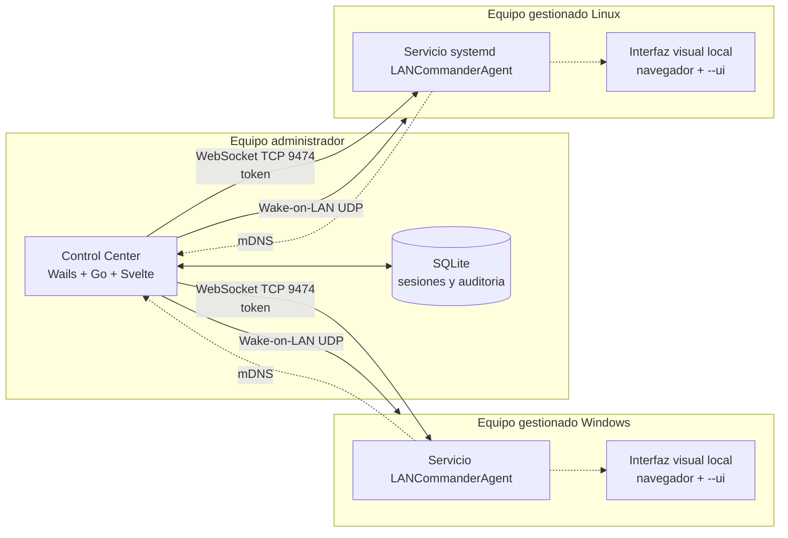
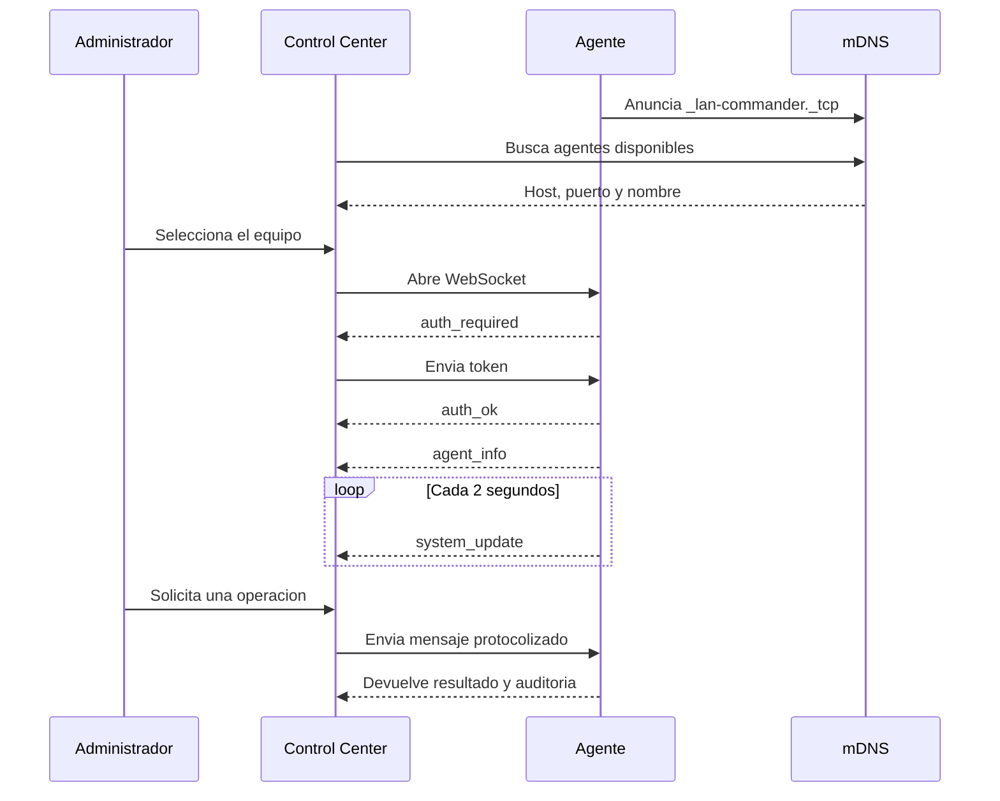
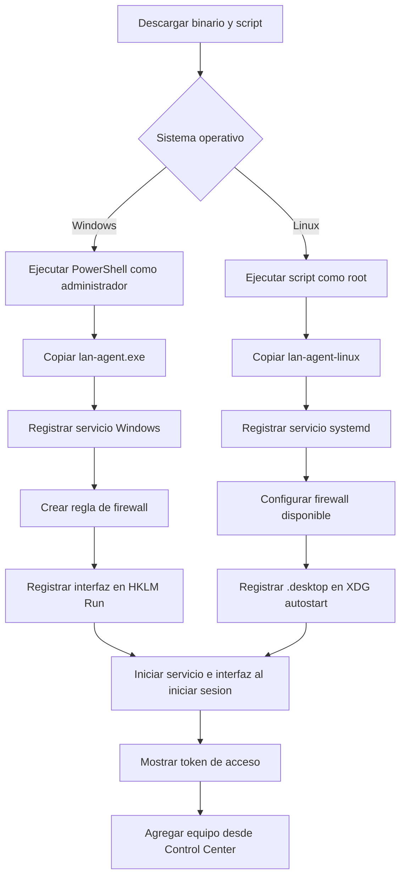
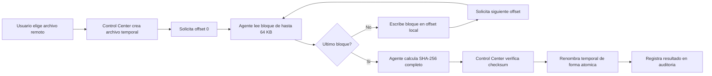
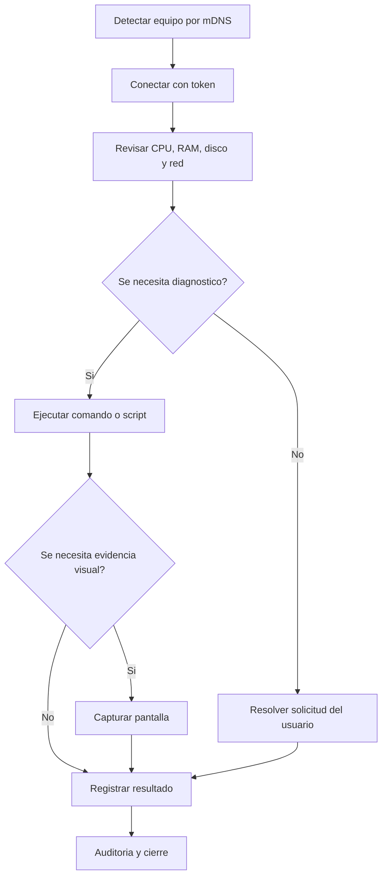

# LAN Commander

LAN Commander es una plataforma de administracion remota para equipos conectados a una misma red local. Un **Control Center** permite gestionar agentes instalados en PCs Windows y Linux: ejecutar comandos, consultar recursos, explorar archivos, transferir ficheros, capturar pantalla, ejecutar scripts y enviar Wake-on-LAN.

El proyecto esta pensado para redes internas donde no se quiere depender de SSH ni de un servicio en la nube. El descubrimiento usa mDNS y las conexiones se inician desde el equipo administrador.

> Estado actual: el Control Center, el agente como servicio, la transferencia de archivos por bloques y la interfaz visual local del agente estan implementados. La interfaz del agente muestra transparencia y estado del servicio; las notificaciones, el registro de actividad local y la bandeja del sistema siguen siendo mejoras futuras.

## Indice

- [Arquitectura](#arquitectura)
- [Componentes](#componentes)
- [Flujo general](#flujo-general)
- [Casos de uso](#casos-de-uso)
- [Tecnologias](#tecnologias)
- [Instalacion paso a paso](#instalacion-paso-a-paso)
- [Primer uso](#primer-uso)
- [Compilar desde el codigo](#compilar-desde-el-codigo)
- [Seguridad](#seguridad)
- [Estructura del repositorio](#estructura-del-repositorio)
- [Pruebas y verificacion](#pruebas-y-verificacion)
- [Estado y proximas mejoras](#estado-y-proximas-mejoras)

## Arquitectura

La solucion tiene tres elementos principales:

1. **Control Center**: aplicacion de escritorio para el administrador.
2. **Agente**: servicio privilegiado instalado en cada equipo gestionado.
3. **Interfaz visual del agente**: interfaz web local que se abre en el navegador del usuario y muestra estado, version, puerto y aviso de gestion.



El servicio del agente trabaja en segundo plano y no necesita que un usuario haya iniciado sesion. La interfaz visual es un modo separado del mismo binario y solo se inicia en una sesion grafica.

## Componentes

### Control Center

Aplicacion de escritorio construida con Wails. Incluye:

- Descubrimiento de agentes por mDNS.
- Conexion WebSocket y autenticacion por token.
- Dashboard de CPU, memoria, discos, red y uptime.
- Ejecucion de comandos individuales y multi-equipo.
- Explorador de archivos.
- Transferencia de archivos por bloques con reensamblado y verificacion SHA-256.
- Captura de pantalla.
- Ejecucion de scripts guardados.
- Sesiones persistentes en SQLite.
- Registro de auditoria.
- Wake-on-LAN.

### Agente

Binario Go que puede ejecutarse en primer plano o instalarse como servicio de sistema. Sus capacidades incluyen:

- Servidor WebSocket para operaciones remotas.
- Autenticacion por token.
- Ejecucion de comandos con timeout.
- Listado, lectura y escritura de archivos por bloques.
- Captura de pantalla.
- Metricas del sistema.
- Anuncio mDNS.
- Interfaz visual local con `--ui`.

### Interfaz visual del agente

El modo `--ui` inicia un servidor HTTP enlazado exclusivamente a `127.0.0.1`, abre el navegador predeterminado y consulta el estado local del servicio cada pocos segundos.

Actualmente muestra:

- Estado del servicio.
- Ultima comprobacion.
- Version del agente.
- Puerto configurado.
- Aviso de la organizacion que gestiona el equipo.

No ejecuta comandos remotos ni expone un panel de administracion. El control remoto continua perteneciendo al Control Center.

## Flujo general

### Conexion y autenticacion



### Instalacion y primer arranque



### Transferencia de archivos



## Casos de uso

| Tipo de uso | Necesidad | Funcionalidades principales |
|---|---|---|
| Soporte tecnico | Diagnosticar un equipo sin desplazarse | Metricas, comandos, explorador y captura de pantalla |
| Aula o laboratorio | Administrar muchos equipos a la vez | Multi-Exec, scripts, Wake-on-LAN y descubrimiento mDNS |
| Mantenimiento | Ejecutar tareas fuera de horario | Scripts, comandos, transferencia y auditoria |
| Inventario | Saber que equipos estan disponibles | mDNS, informacion del sistema y sesiones guardadas |
| Oficina pequena | Resolver incidencias con poca infraestructura | Servicio local, token por equipo y Control Center de escritorio |
| Red de pruebas | Administrar dispositivos dentro de una LAN aislada | Instaladores, autenticacion opcional solo para laboratorio y firewall |

### Flujo recomendado de soporte



## Tecnologias

| Capa | Tecnologia | Uso |
|---|---|---|
| Control Center | Go 1.25+ | Backend, sesiones, auditoria y operaciones |
| Escritorio | Wails v2.13 | Empaquetado de Go con WebView2 en Windows |
| Frontend | Svelte 5, TypeScript, Vite 8 | Interfaz del Control Center |
| Estilos | Tailwind CSS 4 | Estilos del frontend |
| Agente | Go 1.26+ | Servicio multiplataforma |
| Comunicacion | WebSocket sobre TCP | Operaciones remotas y eventos |
| Descubrimiento | mDNS | Deteccion automatica dentro de la LAN |
| Persistencia | SQLite mediante modernc.org/sqlite | Sesiones, scripts y auditoria |
| Interfaz del agente | HTTP local + HTML/CSS/JavaScript | Estado visible para el usuario final |
| Servicios | kardianos/service | Windows Service y systemd |
| Red local | UDP Wake-on-LAN | Encendido remoto |

### Puertos y protocolos

| Elemento | Valor |
|---|---|
| Servicio del agente | TCP `9474` por defecto |
| Descubrimiento | mDNS `_lan-commander._tcp` |
| Interfaz visual | Puerto local aleatorio en `127.0.0.1` |
| Wake-on-LAN | UDP broadcast |

## Instalacion paso a paso

Los scripts esperan encontrar el binario correspondiente en la misma carpeta:

- Windows: `installers/windows/install-agent.ps1` junto a `lan-agent.exe`.
- Linux: `installers/linux/install-agent.sh` junto a `lan-agent-linux`.

### Windows 10/11

1. Descarga o genera `lan-agent.exe`.
2. Abre PowerShell **como administrador**.
3. Entra en `installers/windows`.
4. Ejecuta el instalador indicando la organizacion, si aplica:

```powershell
.\install-agent.ps1 -ManagedByNotice "Nombre de la organizacion"
```

5. El instalador:
   - Genera un token aleatorio si no proporcionas uno.
   - Copia el agente a `Program Files\LAN Commander Agent`.
   - Registra el servicio `LANCommanderAgent`.
   - Abre el puerto TCP en el Firewall de Windows.
   - Registra la interfaz visual para iniciar sesion.
   - Muestra el token una sola vez al terminar.
6. Guarda el token y usalo al agregar el equipo en el Control Center.

Opciones habituales:

```powershell
# Token propio
.\install-agent.ps1 -AuthToken "un-secreto-largo"

# Puerto diferente
.\install-agent.ps1 -Port 9500

# Permitir solo al equipo administrador
.\install-agent.ps1 -AllowFrom "192.168.1.10"

# Quitar el agente, el servicio, el firewall y la interfaz visual
.\install-agent.ps1 -Uninstall
```

La interfaz visual se abre en el navegador al iniciar sesion. El servicio continua activo aunque el usuario cierre el navegador.

### Linux con systemd

1. Confirma que el equipo usa systemd y tiene una sesion grafica si quieres la interfaz visual.
2. Descarga o genera `lan-agent-linux`.
3. Abre una terminal como root.
4. Entra en `installers/linux`.
5. Ejecuta:

```bash
chmod +x install-agent.sh
sudo ./install-agent.sh --managed-by-notice "Nombre de la organizacion"
```

6. El instalador:
   - Copia el binario a `/usr/local/bin/lan-agent`.
   - Registra el servicio `LANCommanderAgent`.
   - Configura ufw o firewalld si estan disponibles.
   - Registra `/etc/xdg/autostart/lan-commander-ui.desktop`.
   - Muestra el token generado.
7. Guarda el token y agregalo en el Control Center.

Opciones habituales:

```bash
# Token propio
sudo ./install-agent.sh --auth-token "un-secreto-largo"

# Puerto diferente
sudo ./install-agent.sh --port 9500

# Permitir solo al equipo administrador
sudo ./install-agent.sh --allow-from 192.168.1.10

# Desinstalar servicio, binario e interfaz visual
sudo ./install-agent.sh --uninstall
```

En un servidor Linux sin entorno grafico, el servicio remoto funciona normalmente; solo se omite la interfaz visual local.

### Autenticacion sin token

Los instaladores exigen token por defecto. `-NoAuth` en Windows o `--no-auth` en Linux solo debe usarse en una red de laboratorio aislada:

```powershell
.\install-agent.ps1 -NoAuth
```

```bash
sudo ./install-agent.sh --no-auth
```

Sin token, cualquier equipo que alcance el puerto puede intentar ejecutar operaciones con los permisos del servicio.

## Primer uso

1. Ejecuta `control-center\build\bin\lan-commander.exe`.
2. Espera a que los agentes aparezcan por mDNS.
3. Selecciona un equipo descubierto o abre la conexion manual.
4. Introduce host, puerto y token.
5. Comprueba el estado del equipo.
6. Guarda la sesion para reconectar automaticamente.
7. Usa la auditoria para revisar las operaciones realizadas.

Conexion manual por defecto:

- Host: IP del equipo gestionado.
- Puerto: `9474`.
- Token: el mostrado por el instalador.

## Compilar desde el codigo

### Requisitos

- Windows 10/11 para compilar y ejecutar el Control Center.
- Go 1.25 o superior para el Control Center.
- Go 1.26 o superior para el agente.
- Node.js 20 o superior y npm.
- Wails CLI v2.13 o compatible.
- WebView2 para ejecutar el Control Center en Windows.
- No se necesita un compilador C adicional para compilar el agente y su interfaz web local.

Instalar Wails:

```powershell
go install github.com/wailsapp/wails/v2/cmd/wails@v2.13.0
```

### Compilar todo

Desde la raiz del repositorio:

```powershell
.\scripts\build-all.ps1
```

Salidas principales:

```text
agent\build\lan-agent.exe
agent\build\lan-agent-linux
installers\windows\lan-agent.exe
installers\linux\lan-agent-linux
control-center\build\bin\lan-commander.exe
```

### Compilar solo el agente

```powershell
.\scripts\build-agent.ps1 -Target windows
.\scripts\build-agent.ps1 -Target linux
.\scripts\build-agent.ps1 -Target all
```

### Verificar frontend

```powershell
cd control-center\frontend
npm install
npm run check
npm run build
```

### Verificar Go

```powershell
cd agent
go test -p 1 ./... -race
go vet ./...

cd ..\control-center
go test ./...
go vet ./...
```

## Seguridad

### Protecciones actuales

- Los instaladores generan token automaticamente.
- El agente puede restringir el firewall por IP mediante `AllowFrom` o `--allow-from`.
- La interfaz visual solo escucha en `127.0.0.1`.
- Las descargas se escriben en un archivo temporal y se renombran atomicamente despues de validar checksum.
- Las acciones se registran en la auditoria del Control Center.

### Limitaciones conocidas

- El trafico no usa TLS por defecto.
- El agente acepta parametros TLS, pero la negociacion end-to-end desde el Control Center debe completarse antes de considerar TLS una proteccion operativa cerrada.
- Los tokens guardados en la base local no estan cifrados en reposo.
- La politica `CheckOrigin` del WebSocket debe endurecerse para despliegues fuera de una LAN controlada.
- `--no-auth` elimina la proteccion del agente y no debe usarse en produccion.
- El control remoto permite operaciones privilegiadas; debe existir autorizacion clara de los usuarios y de la organizacion.

### Recomendaciones de despliegue

1. Usa un token distinto por equipo.
2. Restringe el firewall a la IP o subred del administrador.
3. No expongas el puerto del agente directamente a Internet.
4. Usa una VLAN o red de administracion separada cuando sea posible.
5. Protege el equipo administrador y sus archivos SQLite.
6. Informa a los usuarios cuando sus equipos esten gestionados.
7. Planifica mTLS como evolucion de la autenticacion compartida por token.

## Estructura del repositorio

```text
lan-commander/
├── agent/
│   ├── cmd/lan-agent/          Entrada del agente y gestion del servicio
│   └── internal/
│       ├── discovery/          Anuncio mDNS
│       ├── executor/            Comandos del sistema
│       ├── filesystem/          Directorios y archivos por bloques
│       ├── protocol/            Mensajes compartidos
│       ├── screenshot/          Captura de pantalla
│       ├── server/              Servidor WebSocket
│       ├── system/              Metricas
│       └── ui/                  Interfaz visual local
├── control-center/
│   ├── app.go                   Bindings y operaciones del escritorio
│   ├── backend/                 Cliente, auditoria, sesiones, scripts y WOL
│   └── frontend/                Svelte, TypeScript, Vite y Tailwind
├── installers/
│   ├── windows/                 PowerShell y payload Windows
│   └── linux/                   Bash y payload Linux
├── scripts/                     Compilacion reproducible
└── docs/                        Especificaciones y planes
```

## Pruebas y verificacion

La verificacion realizada para esta version incluye:

- `go test -p 1 ./... -race` en el agente.
- `go vet ./...` en el agente.
- `go test ./...` y `go vet ./...` en el Control Center.
- `npm run check` sin errores ni avisos.
- `npm run build` del frontend.
- Build de produccion Wails del Control Center.
- Compilacion cruzada del agente para Linux amd64.
- Analisis sintactico de los scripts PowerShell.

El chequeo `bash -n` debe ejecutarse en Linux o WSL; el entorno Windows usado para esta auditoria no tenia disponible el subsistema Bash.

## Estado y proximas mejoras

### Implementado

- Control Center de escritorio.
- Agente Windows y Linux como servicio.
- Descubrimiento mDNS.
- Autenticacion por token desde instaladores.
- Ejecucion de comandos y scripts.
- Metricas del sistema.
- Explorador y transferencia de archivos por bloques con SHA-256.
- Captura de pantalla en backend.
- Wake-on-LAN.
- Sesiones y auditoria SQLite.
- Interfaz visual local del agente.

### Proximas mejoras

- Bandeja del sistema para la interfaz visual.
- Notificaciones de actividad y solicitudes de ayuda.
- Registro de actividad visible para el usuario final.
- Botones pendientes en el Control Center para captura, descarga y desconexion.
- TLS por defecto con validacion de certificados.
- Cifrado de tokens en reposo.
- Endurecimiento de `CheckOrigin`.
- Mas pruebas de integracion y pruebas reales de instalacion en Windows y Linux.

## Documentacion relacionada

- [Especificacion de interfaz del agente](docs/superpowers/specs/2026-07-27-agent-client-ui-design.md)
- [Plan original de la interfaz del agente](docs/superpowers/plans/2026-07-27-agent-client-ui-fase-1.md)
